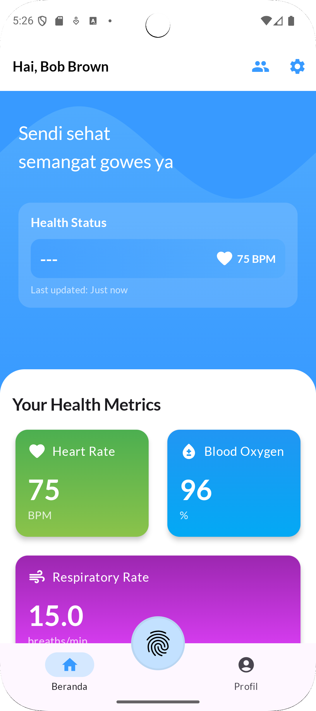
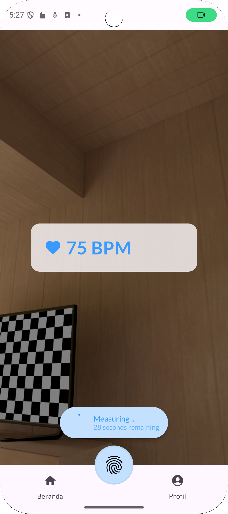
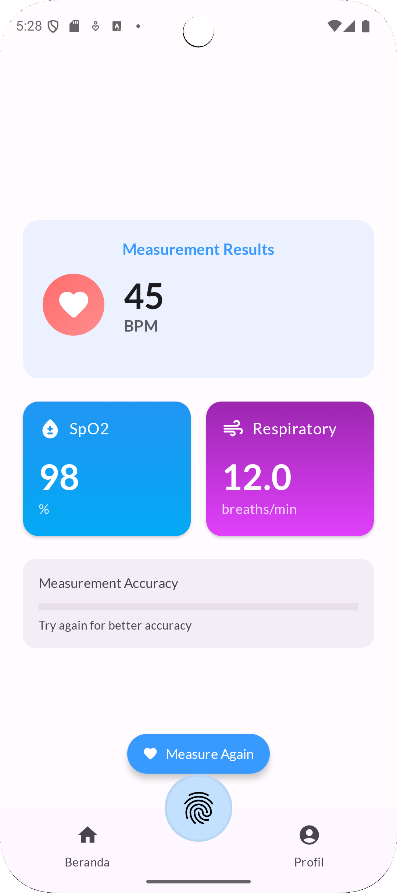
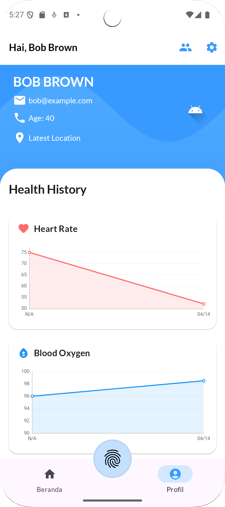
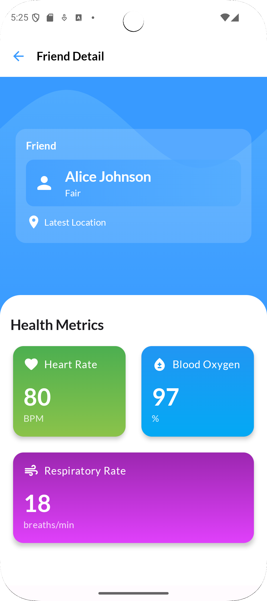

# Lumea - Health Monitoring App

Lumea is an innovative mobile health monitoring application designed to empower users in managing their well-being more proactively. By utilizing advanced imaging and data analysis, Lumea enables users to measure key vital signs such as heart rate and respiratory rate directly through their smartphone camera. The app also facilitates secure sharing of real-time health information with selected family members, friends, or caregivers, fostering a stronger support system. With intuitive dashboards and historical tracking, users can monitor their health patterns over time, gain personalized insights, and make informed lifestyle decisions. Lumea redefines everyday health monitoring by making it accessible, connected, and insight-driven.

## Features

- **PPG-based Health Monitoring**: Measure heart rate, blood oxygen (SpO2), and respiratory rate using the smartphone camera
- **Health Risk Assessment**: AI-powered health risk prediction based on vital signs
- **Friend Connections**: Add friends and view their health data
- **Health History**: Track and visualize health metrics over time with interactive charts
- **Location Sharing**: Optional location sharing for connected users
- **User Profiles**: Personalized profile with health data visualization

## Screenshots

| Home Screen | Measurement Screen | Results Screen |
|-------------|-------------------|----------------|
|  |  |  |

| Profile Screen | Friend Detail Screen |
|----------------|----------------------|
|  |  |

## Technology Stack

### Frontend
- **UI Framework**: Jetpack Compose
- **Architecture**: MVVM (Model-View-ViewModel)
- **Camera**: CameraX for PPG measurements
- **Networking**: Retrofit with OkHttp
- **Authentication**: Token-based auth with refresh tokens
- **Data Persistence**: DataStore for token management
- **Charts**: MPAndroidChart for health data visualization
- **Machine Learning**: TensorFlow Lite for health risk prediction

### Backend
- **Framework**: Hono 
- **Runtime**: Bun 
- **Validation**: Zod for schema validation and type safety
- **Database**: SQLite for lightweight, serverless data storage
- **Authentication**: JWT-based authentication with secure token handling

## Project Structure

- **UI Layer**:
  - `ui/screens/`: Screen-level composables for each app screen
  - `ui/components/`: Reusable UI components
  - `ui/theme/`: App theming and styling
  - `ui/viewmodel/`: ViewModels for each screen
  - `ui/navigation/`: Navigation components and routes

- **Data Layer**:
  - `data/api/`: API interfaces and network configuration
  - `data/model/`: Data models for API responses and app state
  - `data/repository/`: Repositories for handling data operations
  - `data/auth/`: Authentication and token management
  - `data/sensor/`: Camera sensor data processing for PPG

- **Domain Layer**:
  - `domain/`: Business logic components
  - `domain/model/`: Core domain models
  - `domain/HeartRateCalculator.kt`: Algorithm for heart rate calculation

## Key Components

### Health Monitoring

The app uses the device camera to measure vital signs through Photoplethysmography (PPG):
- Heart rate (BPM)
- Blood oxygen saturation (SpO2)
- Respiratory rate

### Friend Connections

Users can search for and add friends, view pending friend requests, and see their friends' health data.

### Health History Charts

Health metrics are visualized over time using interactive line charts

## Getting Started

### How to use
Simply download the apk in apk folder

## License

This project is licensed under the MIT License - see the LICENSE file for details.

## Acknowledgments

- [TensorFlow Lite](https://www.tensorflow.org/lite) for on-device machine learning
- [MPAndroidChart](https://github.com/PhilJay/MPAndroidChart) for data visualization
- [CameraX](https://developer.android.com/training/camerax) for camera integration

## Team

Lumea was developed by Team FindIT, consisting of:

- **Muhammad Zaki** - [GitHub](https://github.com/mzaki9)
- **Hugo Sabam Augusto** - [GitHub](https://github.com/miannetopokki)
- **Albert Ghazaly** - [GitHub](https://github.com/albertghazaly)

## Video Demo
https://drive.google.com/file/d/1nQ-HL-KpSHWRhhWlJmOrGTgX4wmotsfv/view?usp=drive_link

## Backend Repository
https://github.com/mzaki9/lumea-backend